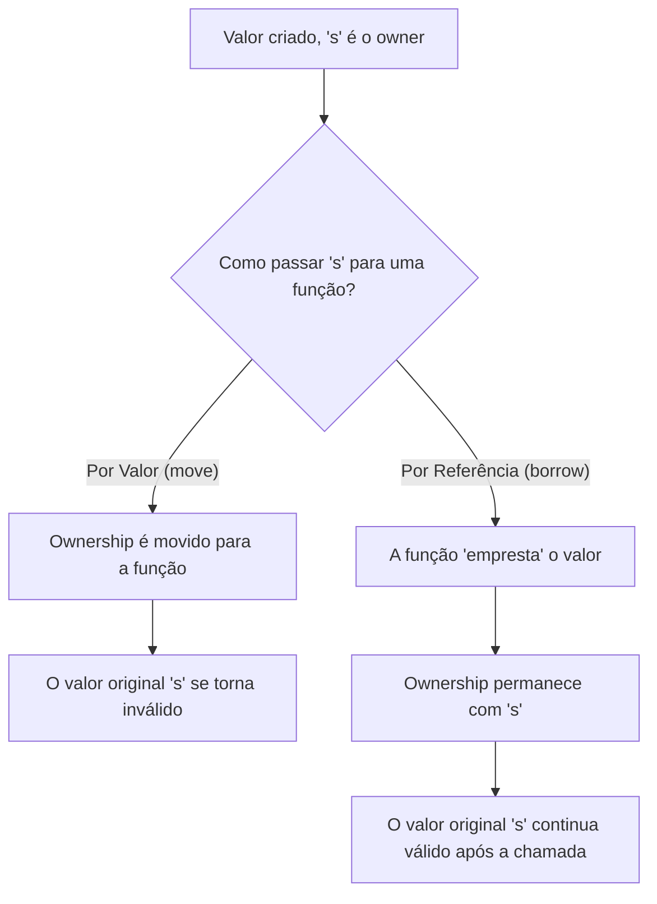

# 🦀 Rust: Performance, Segurança e Concorrência

Rust é uma linguagem de programação de sistemas moderna, de código aberto, focada em três objetivos principais: **segurança**, **velocidade** e **concorrência**. Criada pela Mozilla Research, ela foi projetada para resolver problemas que atormentam o desenvolvimento de software de baixo nível há décadas, especialmente os relacionados à segurança de memória, sem a necessidade de um *garbage collector* (coletor de lixo).

Ela combina a performance e o controle de baixo nível de linguagens como C e C++ com um poderoso sistema de tipos e um compilador rigoroso que garante a segurança do código em tempo de compilação.

-----

## 🛡️ Segurança de Memória Sem Garbage Collector

A característica mais revolucionária do Rust é como ele gerencia a memória. Em vez de usar um coletor de lixo (que pode introduzir pausas imprevisíveis na execução) ou exigir gerenciamento manual de memória (fonte de muitos bugs em C/C++), Rust introduz um modelo de **ownership (posse)**.

Este modelo é um conjunto de regras que o compilador verifica em tempo de compilação. Se qualquer uma das regras for violada, o programa simplesmente não compila. Isso elimina classes inteiras de bugs, como *null pointer dereferences*, *dangling pointers* e *data races*.

### Ownership (Posse)

Cada valor em Rust tem uma variável que é sua *owner* (proprietária).

1.  Só pode haver **um owner** por vez.
2.  Quando o owner sai de escopo, o valor é **descartado** (*dropped*), e sua memória é liberada automaticamente.

<!-- end list -->

```rust
{
    let s1 = String::from("hello"); // s1 é a owner de "hello"
    let s2 = s1; // A posse de "hello" é MOVIDA de s1 para s2

    // A linha abaixo causaria um erro de compilação!
    // println!("{}", s1); // s1 não é mais válido, pois não é mais o owner
} // s2 sai de escopo, "hello" é liberado da memória
```

### Borrowing (Empréstimo)

Para usar um valor sem transferir sua posse, podemos "emprestá-lo" através de *referências*.

  - **Referências imutáveis (`&T`)**: Permitem ler o dado. Você pode ter várias referências imutáveis ao mesmo tempo.
  - **Referências mutáveis (`&mut T`)**: Permitem modificar o dado. Você só pode ter **uma** referência mutável em um determinado escopo.

A regra fundamental é: em um dado escopo, você pode ter **ou uma referência mutável ou qualquer número de referências imutáveis**, mas não ambos. Isso é o que previne *data races* em tempo de compilação.

```rust
fn calcula_tamanho(s: &String) -> usize { // 's' é uma referência (empréstimo)
    s.len()
} // 's' sai de escopo, mas o valor que ele referencia não é liberado

let s1 = String::from("olá");
let tamanho = calcula_tamanho(&s1); // Passamos uma referência de s1
println!("O tamanho de '{}' é {}.", s1, tamanho); // s1 continua válido
```

### Lifetimes (Tempo de Vida)

*Lifetimes* são uma forma de o compilador garantir que todas as referências emprestadas sejam válidas. Na maioria dos casos, o compilador consegue inferi-los automaticamente, então o desenvolvedor não precisa se preocupar com eles.

-----

## ✨ Outras Características Notáveis

### Performance: Abstrações de Custo Zero

Rust permite escrever código de alto nível com abstrações poderosas (como iteradores, closures e tipos genéricos) com a confiança de que elas serão compiladas para um código de máquina extremamente eficiente, sem sobrecarga de performance em tempo de execução. O desempenho é comparável ao de C e C++.

### Concorrência Sem Medo (Fearless Concurrency)

O modelo de ownership e borrowing se estende naturalmente para a programação concorrente. O compilador garante em tempo de compilação que não haverá *data races*, um dos tipos mais difíceis de bugs em sistemas paralelos. Isso permite escrever código concorrente com muito mais segurança e confiança.

### Ecossistema Moderno: Cargo e Crates.io

  - **Cargo**: É a ferramenta de build e gerenciador de pacotes do Rust. Ele lida com a compilação de código, download e gerenciamento de dependências, execução de testes, geração de documentação e muito mais. É uma ferramenta unificada que simplifica enormemente o fluxo de trabalho.
  - **Crates.io**: É o registro de pacotes (chamados de *crates*) da comunidade Rust. Similar ao PyPI (Python) ou npm (Node.js), é um repositório central com milhares de bibliotecas de código aberto prontas para serem usadas em qualquer projeto.

-----

## 🧠 Visualizando o Modelo de Ownership

O diagrama a seguir ilustra a diferença entre mover a posse e emprestar um valor.



-----

## 🎯 Onde o Rust Brilha?

Graças à sua combinação única de performance, segurança e controle, Rust é uma excelente escolha para:

  - **Sistemas de Baixo Nível**: Desenvolvimento de sistemas operacionais, kernels, drivers e outros softwares que precisam de controle total sobre o hardware.
  - **WebAssembly (Wasm)**: Compilar código para rodar no navegador com performance próxima à nativa. Rust é uma das melhores linguagens para Wasm.
  - **Serviços de Rede e Backend**: Construir servidores web, APIs e microserviços de alta performance, seguros e com baixo consumo de recursos.
  - **Ferramentas de Linha de Comando (CLI)**: Criar ferramentas de CLI rápidas, confiáveis e que funcionam em múltiplas plataformas.
  - **Sistemas Embarcados**: Programar microcontroladores e dispositivos com recursos limitados onde a confiabilidade é crítica.
  - **Game Development**: Construção de motores de jogos e lógica de jogo onde a performance é essencial.

-----

## 🚀 Começando com Rust

O ecossistema Rust torna o processo de instalação e criação de projetos muito simples.

1.  **Instale o Rust**: A maneira recomendada é através do `rustup`, o instalador oficial da toolchain Rust. Execute o seguinte comando no seu terminal:
    ```sh
    curl --proto '=https' --tlsv1.2 -sSf https://sh.rustup.rs | sh
    ```
2.  **Crie um novo projeto com o Cargo**:
    ```sh
    cargo new hello_rust
    ```
3.  **Entre na pasta do projeto**:
    ```sh
    cd hello_rust
    ```
4.  **Compile e execute**: O Cargo faz todo o trabalho.
    ```sh
    cargo run
    ```
    Isso irá compilar seu projeto e, se tudo estiver certo, você verá a saída `Hello, world!` no terminal. O código inicial é gerado automaticamente em `src/main.rs`.

<!-- end list -->

```rust
// src/main.rs (gerado pelo `cargo new`)
fn main() {
    println!("Hello, world!");
}
```